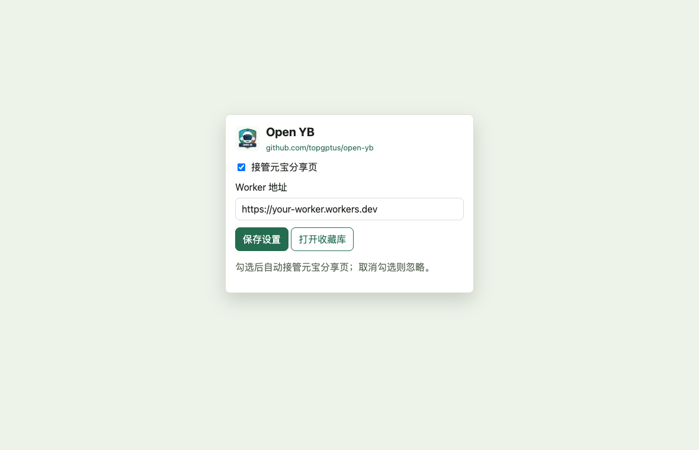
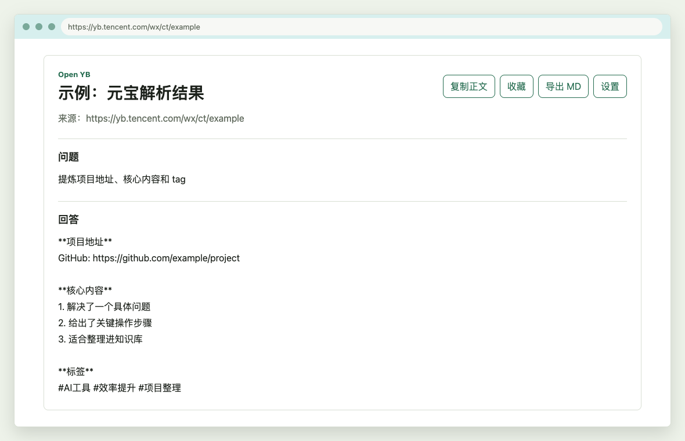
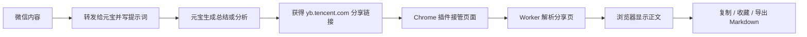

# Open YB

Open YB 是一个把腾讯元宝微信分享链接转成浏览器可读内容的小工具。它由两部分组成：

- Cloudflare Worker：负责解析元宝公开分享页里的纯文本内容。
- Chrome 插件：负责在 Windows / macOS 的 Chrome 里接管元宝链接，显示内容、复制、收藏、导出 Markdown。

项目地址：<https://github.com/topgptus/open-yb>

示例链接：

```text
https://yb.tencent.com/wx/ct/YFJCmiMxnhFCZJ
```

腾讯元宝分享页在普通电脑浏览器里通常会提示“请在微信客户端打开该链接”。Open YB 的目标就是把这个过程变简单：你在微信里把公众号文章、视频号内容或其他素材转发给元宝，让元宝总结、概括、提炼信息；再把元宝生成的分享链接放到电脑浏览器里打开，插件会自动调用 Worker 解析出正文，最后可以复制、收藏或导出 Markdown，放进知识库、NotebookLM、Obsidian、Notion 等工具里继续使用。

Worker 会使用微信 WebView User-Agent 请求分享页，读取服务端渲染 HTML 中的 `__NEXT_DATA__`，再提取标题、用户问题、元宝回答、图片链接和部分元数据。

以前整理微信视频号或公众号内容，常见做法是下载视频、找字幕工具、装浏览器插件、用付费提取工具，再手动整理成笔记。现在可以换一种更轻的方式：直接利用微信里的元宝多模态能力，让元宝先帮你看文章、看视频、总结内容、拆解文案，再用 Open YB 把元宝结果转成电脑端可复制、可收藏、可导出的 Markdown。

你也可以发挥自己的脑洞，充分利用微信原生态多模态模型来提升效率。Open YB 不限定你怎么问元宝，只负责把元宝已经生成的分享结果带回浏览器和知识库。

## 典型工作流

1. 在微信里添加腾讯元宝好友。
2. 看到有价值的微信公众号文章、视频号、聊天内容或网页素材时，直接转发给元宝。
3. 转发时配上合适提示词，例如：

```text
请总结这篇文章的核心观点，提炼项目地址、关键步骤、适合人群和标签。
```

```text
请概括这条视频的核心内容，拆解它的文案结构、开头钩子、转折点和行动号召。
```

```text
请把这篇内容整理成 Markdown 笔记，包含摘要、要点、可执行步骤、关键词和延伸问题。
```

4. 元宝生成回答后，拿到 `yb.tencent.com/wx/ct/...` 分享链接。
5. 在 Windows 或 macOS 的 Chrome 中打开这个链接。
6. Open YB 插件自动接管页面，调用你部署的 Worker，把内容转成可阅读文本。
7. 一键复制、收藏，或导出 Markdown。
8. 把 Markdown 放入知识库、NotebookLM、Obsidian、Notion 或其他资料库。

这个流程适合把原本需要手机打开、手动复制、反复整理的微信内容处理过程，变成“微信转发给元宝 -> 电脑浏览器打开 -> 导出 MD”的轻量链路。

## 功能

- Web UI：粘贴元宝分享链接，页面显示解析出的回答文本。
- 一键复制：复制解析出的元宝回答。
- JSON API：传入元宝 URL，返回结构化内容。
- Text API：传入元宝 URL，返回纯文本回答。
- CORS：API 默认允许跨域调用。
- Chrome 插件：打开元宝微信分享链接时自动接管页面，显示正文、复制、收藏和导出 Markdown。

## 快速开始

### 1. 部署 Worker

先注册并登录 Cloudflare。不会注册也没关系，直接搜索“Cloudflare 注册”和“Cloudflare 手动创建 Worker”即可，Cloudflare 后台可以直接在线创建 Worker。

最简单的方式：

1. 打开 Cloudflare Workers。
2. 新建一个 Worker。
3. 把本项目的 `worker.js` 内容复制进去。
4. 保存并部署。
5. 复制部署后的 Worker 地址，后面填到 Chrome 插件里。

如果你熟悉命令行，也可以在本仓库中用 Wrangler 部署：

```bash
npx wrangler deploy worker.js --name open-yb
```

部署后会得到一个 Worker 地址，例如：

```text
https://your-worker.workers.dev
```

本项目默认不配置 API Key。目的是让个人使用时足够简单：复制 `worker.js`、部署 Worker、安装 Chrome 插件、填入 Worker 地址即可。Cloudflare Worker 的免费额度通常足够个人和小团队日常使用，具体额度以 Cloudflare 后台当前说明为准。如果你要公开给多人使用，可以自行在 Worker 前面加访问控制、Cloudflare Access、Key 校验或限流。

### 2. 安装 Chrome 插件

`extension/` 目录提供了一个 Manifest V3 Chrome 插件，用于把“请在微信客户端打开该链接”的页面变成可阅读、可收藏、可导出的阅读器。

1. 打开 Chrome 的扩展管理页：

```text
chrome://extensions/
```

2. 打开“开发者模式”。
3. 点击“加载已解压的扩展程序”。
4. 选择本仓库的 `extension/` 目录。
5. 点击浏览器工具栏里的 Open YB 图标，确认 Worker 地址正确。

### 3. 配置插件

1. 点击 Chrome 工具栏里的 Open YB 图标。
2. 打开“接管元宝分享页”。
3. 填入你自己的 Worker 地址，例如：

```text
https://your-worker.workers.dev
```

4. 保存设置。
5. 如果 Chrome 弹出域名访问权限确认，同意即可。

### 4. 打开元宝分享链接

1. 保持插件开关为开启。
2. 在 Chrome 中打开元宝分享链接：

```text
https://yb.tencent.com/wx/ct/YFJCmiMxnhFCZJ
```

3. 插件会覆盖原来的限制页，并显示 Worker 解析出的内容。
4. 点击“复制正文”可以复制回答文本。
5. 点击“收藏”会把内容保存到 Chrome 本地存储。
6. 点击“设置”或插件弹窗里的“打开收藏库”，可以管理收藏、合并导出 Markdown。

## 界面预览

### 插件配置

点击 Chrome 工具栏里的 Open YB 图标，可以配置 Worker 地址。勾选“接管元宝分享页”后，插件会自动接管 `yb.tencent.com/wx/ct/...` 页面；取消勾选则不会处理元宝链接。



### 浏览器阅读

打开元宝分享链接后，插件会把原来的“请在微信客户端打开该链接”页面替换成可阅读页面。你可以复制正文、收藏，或者导出当前内容为 Markdown。



### 收藏库

收藏库支持保存、复制、删除、单篇导出，也支持勾选多篇后复制合并 Markdown 或导出合并 Markdown，适合整理到知识库。


## Chrome 插件能力

- 开关控制：插件弹窗里可以开启或关闭元宝分享页接管。
- Worker 配置：默认 Worker 地址为 `https://your-worker.workers.dev`，安装后需要改成你自己部署的 Worker。
- 自动接管：访问 `https://yb.tencent.com/wx/ct/...` 或 `https://yuanbao.tencent.com/wx/ct/...` 时，插件会调用 Worker 的 `/api/parse` 解析正文。
- 当前页操作：显示标题、问题、回答，支持一键复制正文、收藏、导出当前内容为 Markdown。
- 收藏库：在插件设置页管理本地收藏，支持单篇复制、单篇导出、删除。
- 合并导出：勾选多篇收藏后，可以复制合并 Markdown 或下载合并 Markdown 文件。
- 知识库友好：导出的 Markdown 可以直接放进 NotebookLM、Obsidian、Notion、Dify 知识库或其他 RAG / 笔记系统。

## 提示词示例

你可以根据素材类型给元宝不同的提示词。Open YB 不负责调用元宝生成内容，它只负责把元宝已经生成的分享结果在电脑浏览器中打开、整理和导出。

### 公众号文章总结

```text
请总结这篇文章，输出：
1. 一句话摘要
2. 5 个核心观点
3. 值得保存的金句
4. 可执行步骤
5. 适合打的标签
6. 如果要放进知识库，建议的标题
```

### 公众号项目提炼

```text
请总结这篇文章的核心观点，提炼：
1. 项目地址
2. 关键步骤
3. 适合人群
4. 核心内容
5. 标签
6. 可以直接放入知识库的 Markdown 笔记
```

### 视频号内容概括

```text
请概括这条视频的核心内容，并拆解：
1. 开头如何吸引注意力
2. 中间如何展开论证或讲故事
3. 结尾如何引导行动
4. 有哪些可复用的文案技巧
5. 适合二次创作的选题角度
```

### 视频教程步骤和菜谱

```text
请总结这个视频的操作详细步骤。如果视频里包含菜谱，请提炼：
1. 食材清单
2. 调料用量
3. 每一步操作
4. 火候和时间
5. 容易失败的地方
6. 最终成品特点
请尽量详细，方便我照着复刻。
```

### 爆款视频拆解

```text
请帮我提炼这条视频的架构逻辑，重点分析：
1. 视频结构
2. 文案逻辑
3. 开头钩子
4. 核心卖点
5. 情绪推进方式
6. 为什么它可能成为爆款
7. 如果要复刻类似内容，需要注意哪些点
务必详细说明。
```

### 视频 SRT 字幕提取

```text
请帮我提炼这条视频的完整 SRT 字幕。
要求：
1. 必须带时间轴
2. 必须使用标准 SRT 格式
3. 尽量保持原视频说话顺序
4. 如果听不清，请用 [听不清] 标注
```

### 拍摄剪辑分析

```text
请从专业视频制作角度分析这条视频的拍摄和剪辑手法，包括：
1. 镜头设计
2. 构图方式
3. 配色风格
4. 配乐选择
5. 情绪节奏
6. 转场和剪辑节奏
7. 字幕和画面信息密度
8. 适合借鉴的地方
请给出详细分析。
```

### 项目信息提炼

```text
请从这条内容里提炼项目资料：
1. 项目名称
2. 项目地址
3. 解决的问题
4. 核心功能
5. 部署或使用步骤
6. 技术标签
7. 适合收藏到知识库的 Markdown 版本
```

### 知识库笔记格式

```text
请把这段内容整理成 Markdown 笔记，结构为：
# 标题
## 摘要
## 核心要点
## 操作步骤
## 关键链接
## 标签
## 后续可以追问的问题
```

### 插件架构



插件本身不保存云端数据，收藏内容保存在 Chrome 本地 `chrome.storage.local`。如果换电脑或清空浏览器数据，收藏库不会自动同步。

### 权限说明

插件使用的权限：

- `storage`：保存开关、Worker 地址和收藏内容。
- `host_permissions`：允许在元宝分享页运行内容脚本，并请求默认 Worker 和 `workers.dev` 上的 Worker API。
- `optional_host_permissions`：当你把 Worker 地址改成自定义域名时，插件会请求访问该 Worker 域名的权限。

插件采用“内容脚本接管页面”的方式实现，不修改系统代理，也不接管非元宝域名的页面。

### Worker 连接失败排查

如果页面显示 `无法连接 Worker` 或浏览器控制台出现 `net::ERR_CONNECTION_CLOSED`，说明 Chrome 到 Worker 域名的 HTTPS 连接被断开，常见原因是：

- Worker 地址写错，或部署还没有完成。
- `workers.dev` 在当前网络环境不可达。
- Worker 地址末尾带了多余的点，例如 `https://xxx.workers.dev.`。

处理方式：

1. 直接在 Chrome 打开插件提示里的“测试地址”。
2. 如果测试地址能打开但插件仍失败，请在 `chrome://extensions/` 里重新加载 Open YB。
3. 如果测试地址也打不开，先换网络或给 Worker 绑定自定义域名。
4. 在插件弹窗里把 Worker 地址改成可访问的域名，例如 `https://yb.example.com`，并同意 Chrome 弹出的域名访问权限。

插件请求 Worker 时会依次尝试扩展后台请求、内容脚本 CORS 请求、JSONP 桥接。JSONP 桥接需要 Worker 部署新版代码。

## API

### `GET /api/parse`

```bash
curl "https://<your-worker-domain>/api/parse?url=https%3A%2F%2Fyb.tencent.com%2Fwx%2Fct%2FYFJCmiMxnhFCZJ"
```

返回示例：

```json
{
  "sourceUrl": "https://yb.tencent.com/wx/ct/YFJCmiMxnhFCZJ",
  "shareId": "YFJCmiMxnhFCZJ",
  "title": "改变世界的数学公式",
  "description": "这17个公式是人类智慧结晶...",
  "answerTime": "2026年04月16日",
  "questionText": "请用纯文本来讲解一下这 17 个公式",
  "answerText": "这17个公式是人类智慧结晶的巅峰代表...",
  "messages": [],
  "images": [],
  "meta": {
    "errCode": 0,
    "expireTime": 1807420368,
    "backendTraceId": ""
  }
}
```

### `POST /api/parse`

```bash
curl -X POST "https://<your-worker-domain>/api/parse" \
  -H "content-type: application/json" \
  -d '{"url":"https://yb.tencent.com/wx/ct/YFJCmiMxnhFCZJ"}'
```

### `GET /api/text`

```bash
curl "https://<your-worker-domain>/api/text?url=https%3A%2F%2Fyb.tencent.com%2Fwx%2Fct%2FYFJCmiMxnhFCZJ"
```

返回 `text/plain`，内容为解析出的元宝回答文本。

## 本地开发

安装 Wrangler 后运行：

```bash
npx wrangler dev worker.js
```

打开本地地址后，粘贴元宝分享 URL 即可测试。

## Worker 部署

```bash
npx wrangler deploy worker.js --name open-yb
```

也可以创建 `wrangler.toml` 后部署：

```toml
name = "open-yb"
main = "worker.js"
compatibility_date = "2026-04-16"
```

## 元宝分享页绕过逻辑

普通桌面浏览器或普通手机浏览器 User-Agent 请求 `https://yb.tencent.com/wx/ct/...` 时，服务端会返回：

```json
{
  "err_code": "notInWX"
}
```

页面文案通常是：

```text
请在微信客户端打开该链接
```

实测关键检查点是 User-Agent 里是否包含微信内置浏览器标识 `MicroMessenger/...`。Worker 因此使用类似下面的 UA 请求分享页：

```text
Mozilla/5.0 (iPhone; CPU iPhone OS 17_0 like Mac OS X) AppleWebKit/605.1.15 (KHTML, like Gecko) Mobile/15E148 MicroMessenger/8.0.49(0x1800312c) NetType/WIFI Language/zh_CN
```

这个方式可以让服务端返回公开分享内容，而不是客户端限制页。

## 文本解析逻辑

分享页是 Next.js 页面，正文数据在 HTML 的 `__NEXT_DATA__` 中。Worker 会：

1. 请求分享页 HTML。
2. 提取 `<script id="__NEXT_DATA__">...</script>`。
3. 解析 JSON。
4. 读取 `props.pageProps.data.conversation_info`。
5. 优先从 `shareExtraDetailObj.chatInfo[].convs` 提取完整对话。
6. 返回最后一条 `speaker === "ai"` 的文本作为 `answerText`。

## 安全说明

当前 Worker 只允许解析以下域名的 `/wx/ct/` 链接：

- `yb.tencent.com`
- `yuanbao.tencent.com`

这样可以避免把 Worker 变成任意 URL 代理。

## 文件

- `worker.js`：Cloudflare Worker 源码，包含 Web UI 和 API。
- `open-yb.mjs`：本地 Node 调试脚本，用相同 UA 抓取分享页并保存 HTML 快照。
- `extension/`：Chrome 插件源码，包含页面接管、弹窗设置、收藏库和 Markdown 导出。
- `extension/icons/open-yb-logo.svg`：Chrome 插件 Logo 源文件。
- `docs/screenshots/`：README 使用的插件界面截图。

## 加入 AI 交流群

我们目前有 4 个 AI 交流群，接近 2000 位 AI 发烧友在一起交流。群里会讨论最新 AI 工具、模型动态、实战案例、自动化玩法和各种新鲜资讯；每周、每月也会持续分享值得关注的 AI 信息。

欢迎扫码添加好友。添加后会由人工拉你进入交流群，因此可能会有一些延迟。

务必备注：

```text
yb
```

扫码添加：


