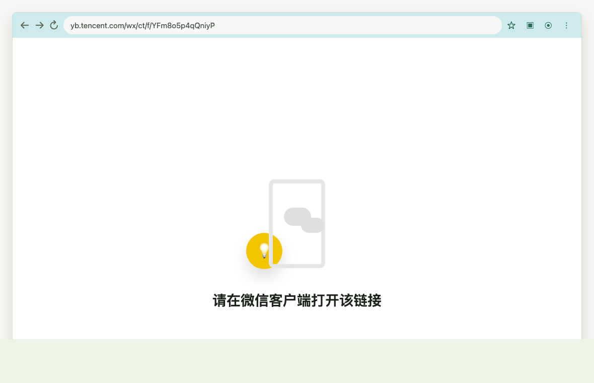
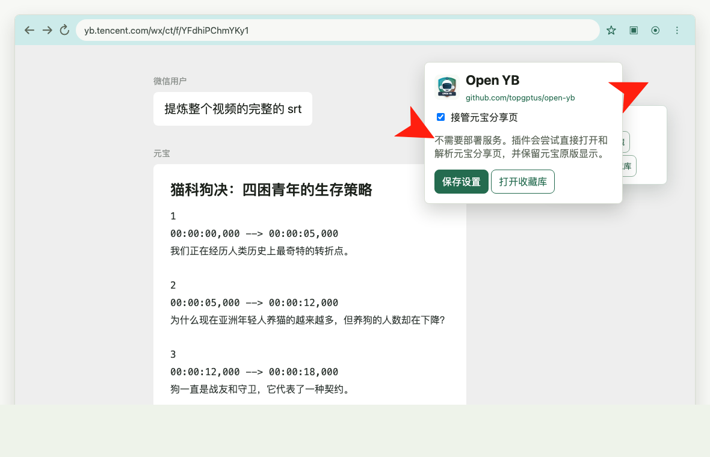
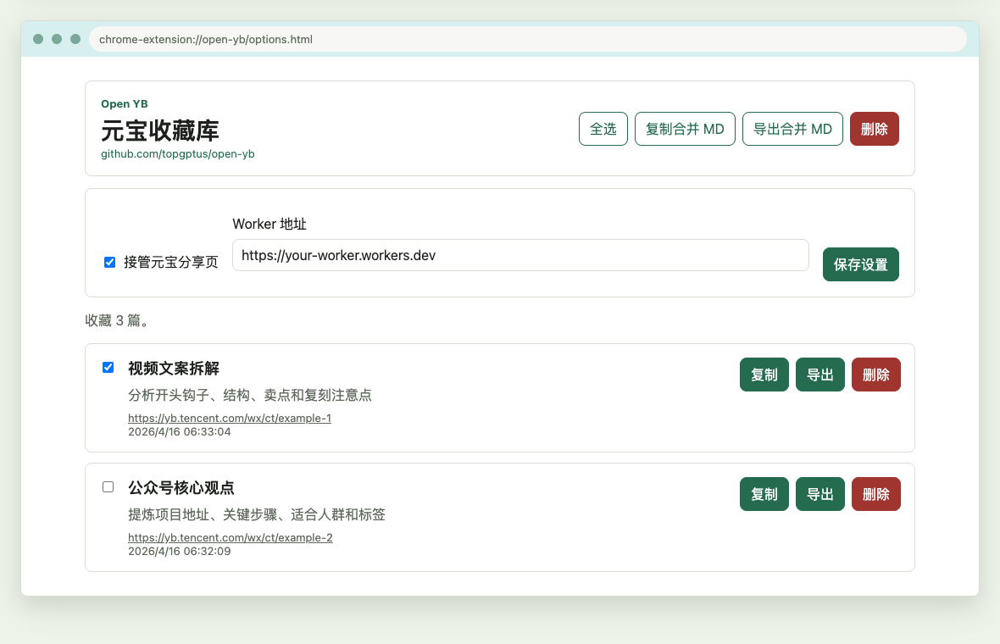

# Open YB

Open YB 是一个把腾讯元宝微信分享链接带回电脑和本地自动化流程的小工具。

演示网站：<https://yb.topgpt.us/>

GitHub：<https://github.com/topgptus/open-yb>

现在项目只保留两个主功能：

- `extension/`：Chrome 插件。在 Windows / macOS 的 Chrome 中打开元宝分享页，尽量保留元宝原版页面，同时提供复制、收藏、导出 Markdown。
- `skills/open-yb/`：本地 Agent Skill。给 Codex、Claude Code、OpenClaw 或自己的脚本使用，把元宝 URL 解析成 Markdown、JSON 或纯文本。

## 更新说明

### v0.2.0

这一版重点优化“批量收集，集中整理”的场景。

- 新增自动收藏：开启后，只要在 Chrome 打开元宝分享链接，解析成功就会自动保存到收藏库。
- 新增收藏去重：优先按 `shareId` 去重，没有 `shareId` 时按去掉 query/hash 后的 URL 去重。重复打开不会生成多条收藏，会更新已有内容。
- 新增自动提取标签：从元宝回答正文里的 `#标签` 自动提取，例如 `#视频理解#本地AI#物体追踪`。
- 新增收藏库筛选：支持关键词搜索、标签筛选、日期筛选。
- 新增标签编辑：每条收藏可以手动调整标签，方便后续检索。
- 优化 Markdown 导出：导出内容带 `title`、`source`、`created`、`tags` frontmatter，更适合进入 Obsidian、NotebookLM、Dify 或 RAG 知识库。

推荐用法：

```text
白天看到内容 -> 转发给元宝并要求输出 tag -> 晚上电脑批量打开链接 -> 自动收藏 -> 按日期/tag 筛选 -> 合并导出 Markdown
```

## 为什么做这个

腾讯元宝分享页在普通电脑浏览器里经常提示：

```text
请在微信客户端打开该链接
```

但实际工作流里，我们经常会在微信里把公众号文章、视频号、网页、聊天内容转发给元宝，让它总结、提炼、拆解视频文案、整理项目地址和标签。元宝生成的结果很有价值，但如果只能在手机里看，后续放进知识库、NotebookLM、Obsidian、Notion 或本地 agent 流程就比较麻烦。

Open YB 的目标很简单：

```text
微信转发给元宝 -> Chrome 打开元宝分享链接 -> 复制 / 收藏 / 导出 MD
```

不用下载视频，不用复杂插件链路，也不用先部署服务。

## 推荐工作流

1. 在微信里添加腾讯元宝好友。
2. 看到值得整理的公众号文章、视频号或网页，直接转发给元宝。
3. 转发时配上你的提示词，例如“总结核心观点”“提炼项目地址”“拆解视频文案结构”，并要求元宝输出 `#标签`。
4. 元宝生成回答后，拿到 `https://yb.tencent.com/wx/ct/...` 分享链接。
5. 在电脑 Chrome 中开启“打开元宝链接后自动收藏”。
6. 一次打开多个元宝分享链接，插件会自动保存并去重。
7. 打开收藏库，按日期或标签筛选当天收集的内容。
8. 批量导出或合并导出 Markdown。
9. 把 Markdown 放进知识库、NotebookLM、Obsidian、Notion、Dify 或本地 agent 流程。

## 使用建议

Open YB 的标签不是用 AI 重新分类，而是从元宝回答正文里提取 `#标签`。所以最稳定的方式，是在你转发给元宝时就让它按固定格式输出标签。

建议在提示词最后加上这一段：

```text
最后请输出两组标签：

核心标签：
#标签1#标签2#标签3#标签4#标签5

技术标签：
#标签1#标签2#标签3#标签4#标签5
```

插件会识别正文里所有形如 `#视频理解`、`#本地AI`、`#物体追踪` 的标签，保存收藏时自动写入收藏库。后续你可以在收藏库里按标签筛选，也可以手动编辑标签。

更推荐让元宝输出短标签：

- 好：`#视频理解`、`#本地AI`、`#项目工具`、`#文案拆解`
- 不建议：`#这是一个很长很长的标签说明`、`#标签：视频理解`

如果你一天会收集很多内容，推荐开启：

```text
接管元宝分享页
打开元宝链接后自动收藏
```

这样晚上只需要批量打开元宝链接，Open YB 会自动完成收藏和去重。

导出 Markdown 时会带上 frontmatter：

```markdown
---
title: "元宝分享内容"
source: "https://yb.tencent.com/wx/ct/..."
created: 2026-04-20
tags:
  - 视频理解
  - 本地AI
---
```

这对 Obsidian、Dify、RAG 知识库和其他 AI 笔记工具更友好。

## Chrome 插件

### 安装

1. 打开 Chrome 扩展管理页：

```text
chrome://extensions/
```

2. 打开“开发者模式”。
3. 点击“加载已解压的扩展程序”。
4. 选择本仓库里的 `extension/` 目录。
5. 点击浏览器工具栏里的 Open YB 图标，确认“接管元宝分享页”已开启。
6. 如果你经常一天打开很多元宝链接，可以同时开启“打开元宝链接后自动收藏”。

### 使用

在 Chrome 中打开元宝分享链接：

```text
https://yb.tencent.com/wx/ct/...
```

插件会尝试用微信 WebView 风格请求头打开页面，并解析页面里的内容。页面阅读体验尽量保持元宝原版显示，右上角会出现 Open YB 工具条：

- `复制正文`：复制元宝回答文本。
- `收藏`：保存当前内容到 Chrome 本地收藏库；开启自动收藏后，打开链接会自动保存并去重。
- `导出 MD`：把当前内容导出为 Markdown。
- `收藏库`：管理所有收藏内容，支持关键词、标签和日期筛选。

### 效果对比

不开启插件时，电脑端 Chrome 打开元宝分享链接通常只能看到“请在微信客户端打开该链接”。手机版微信里虽然可以直接阅读，但如果你想在电脑上复制、整理、导出到 AI 笔记或知识库，会很不方便。

<p align="center">
  
</p>

开启 Open YB 后，Chrome 可以直接打开元宝分享页。页面尽量保留元宝原版阅读效果，同时提供复制正文、收藏、导出 Markdown 和打开收藏库。这样可以把元宝整理好的内容直接导入 NotebookLM、Obsidian、Notion、Dify、RAG 知识库或其他 AI 笔记工具。

<p align="center">
  
</p>

收藏库可以统一管理已经保存的元宝内容。你可以单篇导出，也可以勾选多篇后批量导出多个 Markdown 文件，或者合并导出成一个 Markdown 文件，方便后续进入知识库。

如果元宝回答里包含类似 `#视频理解#本地AI#物体追踪` 的标签，Open YB 会在收藏时自动提取。你也可以在收藏库里手动编辑标签，再按标签或日期筛选当天收集的一批内容。

<p align="center">
  
</p>

### 收藏库

收藏库保存在 Chrome 本地 `chrome.storage.local`，不上传云端。

支持：

- 单篇复制
- 单篇导出 Markdown
- 删除单篇
- 自动提取 `#标签`
- 手动编辑标签
- 关键词搜索
- 标签筛选
- 日期筛选：今天、昨天、近 7 天、本月、指定日期
- 全选
- 批量导出：选中多篇后，每篇分别下载成独立 Markdown 文件
- 合并导出：选中多篇后，合成一个 Markdown 文件下载
- 批量删除

注意：如果换电脑、换浏览器用户或清空浏览器数据，收藏库不会自动同步。

### 插件限制

Open YB 插件能否成功，取决于 Chrome 是否允许扩展稳定影响元宝请求的 `User-Agent`。

如果页面提示 `notInWX` 或仍然要求微信客户端打开，可以先刷新页面；如果仍失败，建议改用下面的本地 Agent Skill。

## 本地 Agent Skill

如果你想让 Codex、Claude Code、OpenClaw 或自己的自动化脚本直接处理元宝 URL，用这个目录：

```text
skills/open-yb/
```

它包含：

- `SKILL.md`：给 agent 读取的使用说明。
- `scripts/parse_yuanbao.py`：本地解析脚本，只使用 Python 标准库，不需要 pip 安装依赖。

### 命令行示例

输出 Markdown：

```bash
python3 skills/open-yb/scripts/parse_yuanbao.py "https://yb.tencent.com/wx/ct/..." --format markdown
```

输出纯文本：

```bash
python3 skills/open-yb/scripts/parse_yuanbao.py "https://yb.tencent.com/wx/ct/..." --format text
```

输出 JSON：

```bash
python3 skills/open-yb/scripts/parse_yuanbao.py "https://yb.tencent.com/wx/ct/..." --format json
```

保存成 Markdown 文件：

```bash
python3 skills/open-yb/scripts/parse_yuanbao.py "https://yb.tencent.com/wx/ct/..." --format markdown -o yuanbao-note.md
```

如果你的 Python HTTPS 证书链有问题，可以强制用 `curl` 抓取：

```bash
python3 skills/open-yb/scripts/parse_yuanbao.py "https://yb.tencent.com/wx/ct/..." --format markdown --fetch-engine curl
```

### Agent 用法

把 `skills/open-yb/SKILL.md` 放进你的 agent skill 目录后，之后可以直接对 agent 说：

```text
请用 open-yb 解析这个元宝链接，并整理成 Markdown 笔记：
https://yb.tencent.com/wx/ct/...
```

适合：

- 把元宝总结结果导入 NotebookLM / Obsidian / Notion。
- 批量整理多个元宝分享链接。
- 在 Codex / Claude Code / OpenClaw 中把微信内容转成可处理文本。
- 接入自己的本地自动化流程。

## 提示词示例

Open YB 不负责调用元宝，它只负责把元宝已经生成的分享结果带回电脑。元宝阶段怎么问，决定了最后导出的内容质量。

### 公众号文章总结

```text
请总结这篇文章，输出：
1. 一句话摘要
2. 5 个核心观点
3. 值得保存的金句
4. 可执行步骤
5. 适合打的标签
6. 如果要放进知识库，建议的标题
```

### 项目资料提炼

```text
请总结这篇文章的核心观点，提炼：
1. 项目地址
2. 解决的问题
3. 核心功能
4. 关键步骤
5. 适合人群
6. 技术标签
7. 可以直接放入知识库的 Markdown 笔记
```

### 视频号内容概括

```text
请概括这条视频的核心内容，并拆解：
1. 开头如何吸引注意力
2. 中间如何展开论证或讲故事
3. 结尾如何引导行动
4. 有哪些可复用的文案技巧
5. 适合二次创作的选题角度
```

### 视频教程步骤

```text
请总结这个视频的操作详细步骤。如果视频里包含菜谱，请提炼：
1. 食材清单
2. 调料用量
3. 每一步操作
4. 火候和时间
5. 容易失败的地方
6. 最终成品特点
请尽量详细，方便我照着复刻。
```

### 爆款视频拆解

```text
请帮我提炼这条视频的架构逻辑，重点分析：
1. 视频结构
2. 文案逻辑
3. 开头钩子
4. 核心卖点
5. 情绪推进方式
6. 为什么它可能成为爆款
7. 如果要复刻类似内容，需要注意哪些点
务必详细说明。
```

### SRT 字幕提取

```text
请帮我提炼这条视频的完整 SRT 字幕。
要求：
1. 必须带时间轴
2. 必须使用标准 SRT 格式
3. 尽量保持原视频说话顺序
4. 如果听不清，请用 [听不清] 标注
```

### 拍摄剪辑分析

```text
请从专业视频制作角度分析这条视频的拍摄和剪辑手法，包括：
1. 镜头设计
2. 构图方式
3. 配色风格
4. 配乐选择
5. 情绪节奏
6. 转场和剪辑节奏
7. 字幕和画面信息密度
8. 适合借鉴的地方
请给出详细分析。
```

## 项目结构

```text
open-yb/
  extension/               Chrome 插件，主功能
  skills/open-yb/          本地 Agent Skill
  assets/qrcode.jpg        AI 交流群二维码
  docs/screenshots/        文档截图素材
  archive/cloudflare-worker/
                            早期 Cloudflare Worker / API / Worker 版插件归档
```

## 为什么 Cloudflare Worker 被归档

早期版本包含 Cloudflare Worker、Web UI、HTTP API 和 Worker 版 Chrome 插件。后面验证下来，对多数个人用户来说，这条链路过重：

- 需要先注册 Cloudflare。
- 需要复制和部署 Worker。
- 插件还要配置 Worker 地址。
- 网络环境不好时还可能遇到 `workers.dev` 连接问题。

所以当前主版本先回到最简单的两个能力：

- 浏览器里用 Chrome 插件。
- 自动化里用本地 skill。

Cloudflare 相关代码没有删除，放在 `archive/cloudflare-worker/`。后续如果要做 Cloudflare KV 云端收藏夹、云端知识库存储、公开 API 或团队同步，再从归档里继续演进会更合适。

## 加入 AI 交流群

我们目前有 4 个 AI 交流群，接近 2000 位 AI 发烧友在一起交流。群里会讨论最新 AI 工具、模型动态、实战案例、自动化玩法和各种新鲜资讯；每周、每月也会持续分享值得关注的 AI 信息。

欢迎扫码添加好友。添加后会由人工拉你进入交流群，因此可能会有一些延迟。

务必备注：

```text
yb
```

扫码添加：


